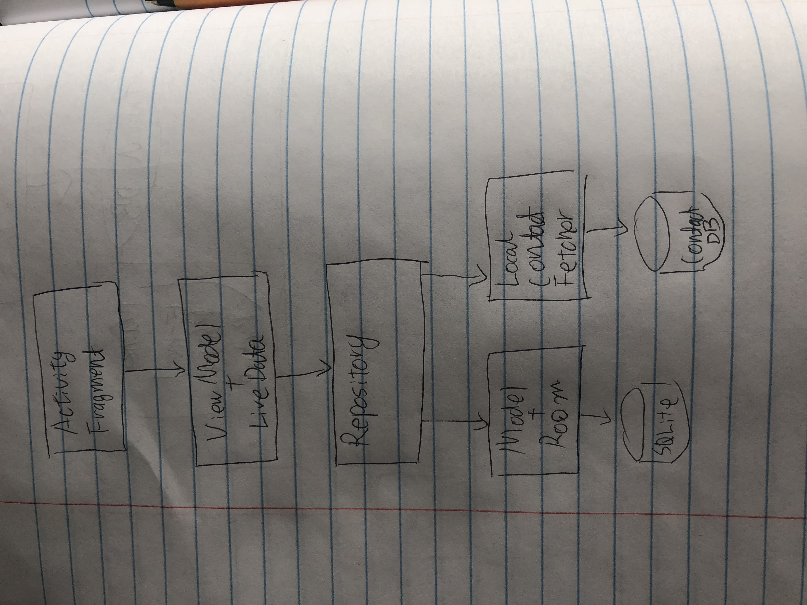

# ContactsAvatar

## Objective

For this task, 
1. Read the contacts list on your device.
2. Create avatars for all the contacts from [adorable.io](http://avatars.adorable.io/) and show the contacts list with the avatars as part of the app you create. You can decide what information to show on the list. We’d expect at least the name and phone number.
3. On clicking on a contact, show the contact details like email, address, etc.

## Architecture
For this task, utilize MVVM pattern plus data repository for single source of truth.

### Model
Data in this task is designed to be tiny POJO of local contact with following entries: name, e-mail, phone number and url for avatar (hash code of aforementioned data). Data is wrapped with [Room](https://developer.android.com/topic/libraries/architecture/room.html) into SQLite. Single source of truth from local contact will be converted to aforementioned POJO on following condition: 1. For the first time DB is created. 2. When contact change is detected. 

### ViewModel
In favor of utilizing Android's lifecycle aware callback view mode, ViewModel is extending `AndroidViewModel`[Ref.](https://developer.android.com/reference/android/arch/lifecycle/AndroidViewModel.html). It observes DataRepository's data and once data is emitted, it will update its view (who is already subscribing to the change)
### View
Using Android's [data binding library](https://developer.android.com/topic/libraries/data-binding/index.html), View is instantiated from its layout's variable. 
- For initial `RecyclerView` (`ContactListFragment`) is bind from `contact_item.xml`'s variable `contact` and `callback`.
- For detailed contact view, `ContactFragment` is bind from `contact_fragment.xml`'s variable `ContactViewModel`.

## Misc.
Along with basic requirement, it has following extensions
- Contact detail fragment will send proper intent based on user's interaction. (e.g. click on phone number will trigger dialer)
- Contact Fetch strategy: 
    - There are ways of detecting real time local contact DB change by running a service that registers `ContentObserver` for contact DB URI. However, for this task, this seems very "overkill" given contact DB change does not happen all the time.
    - Instead of the above approach, this app will fetch local contact DB when `Application` is created (`onCreate()`). I believe this is fair enough for 99% of use cases. 
- For sake of this task, following assumptions were used while accessing local contact DB
    - It will only query default contact db, not accessing external account (e.g. Google contacts)
    - It will use `Contacts.DISPLAY_NAME` for name
    - it will use following strategy to get both phone number and email address
        - If there exist multiple types of data, it will use whichever first appears in order of `Type.Mobile`, `Type.Home`,  `Type.Work`, etc.
        - If none of them exists, it will use default text "Not available";
    - Avatar URL is calculated using hash code of concatenated string of id / name / email / phone number 

## Dependencies
Following libraries were used while working on this task:
- Android Architecture Components
    - [LiveData](https://developer.android.com/topic/libraries/architecture/livedata.html)
    - [ViewModel](https://developer.android.com/topic/libraries/architecture/viewmodel.html)
    - [Room Persistence Library](https://developer.android.com/topic/libraries/architecture/room.html)
    - [Android Data Binding library](https://developer.android.com/topic/libraries/data-binding/index.html)
- Image download
    - [Picasso](https://github.com/square/picasso/)
- Test
    - [ASTL](https://developer.android.com/topic/libraries/testing-support-library/index.html)
    - [Espresso](https://developer.android.com/training/testing/espresso/index.html)
    - [JUnit](https://developer.android.com/training/testing/unit-testing/local-unit-tests.html) and [Mockito](https://github.com/mockito/mockito)
